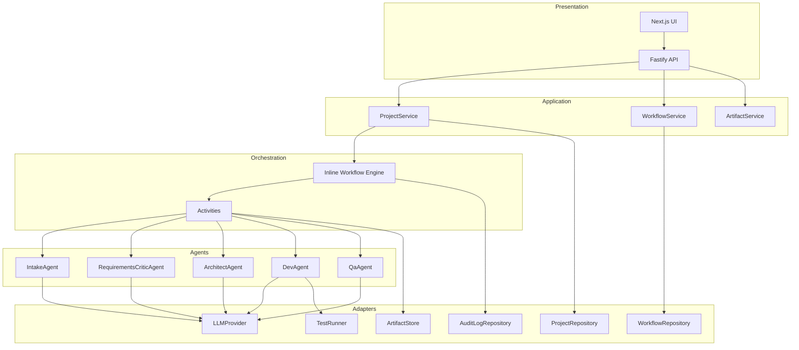
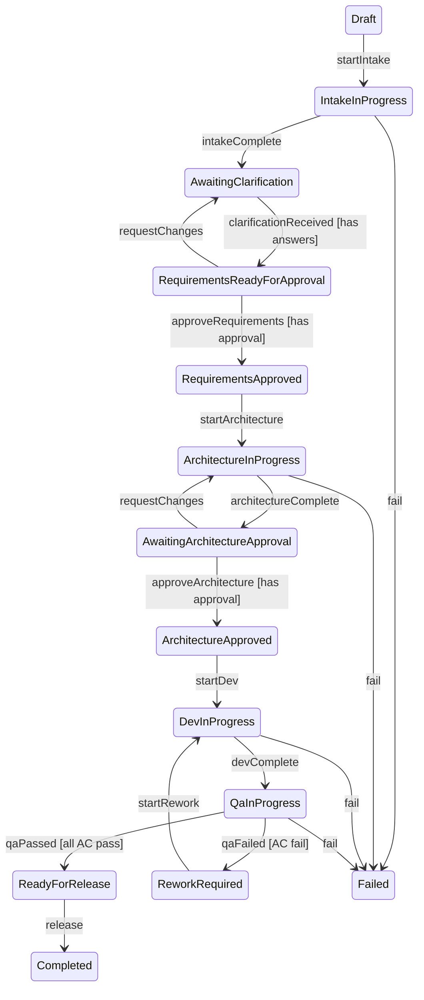
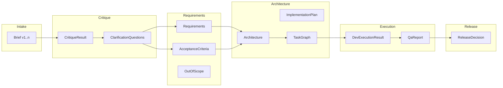

# Workflow JK

Supervised multi-agent software delivery platform. Submit a business idea, watch it become production-ready software through a structured, reviewable, deterministic workflow.

## Architecture

TypeScript monorepo with 10 packages using hexagonal/ports-and-adapters architecture.

```
apps/
  api/         → Fastify REST API server
  web/         → Next.js 15 minimal UI shell
packages/
  contracts/   → Zod schemas & shared types (single source of truth)
  domain/      → Entities, state machine, validation (zero external deps)
  adapters/    → Port interfaces + in-memory/PostgreSQL implementations
  agents/      → IntakeAgent, RequirementsCriticAgent, ArchitectAgent, DevAgent, QaAgent
  orchestration/ → Inline workflow engine with activity dependency injection
  application/ → Service layer (ProjectService, WorkflowService, ArtifactService)
  observability/ → OpenTelemetry + Prometheus exporter + structured logging
  config/      → Environment configuration
  testing/     → Fixtures, deterministic fakes, test utilities
  evaluation/  → Evaluation harness for agent outputs
```

## System Architecture



## 5-Agent Pipeline

The platform implements a 5-agent pipeline with approval gates at each stage:

1. **Intake Agent** - Translates business ideas into structured briefs
2. **Critic Agent** - Reviews requirements, identifies gaps, proposes clarifications
3. **Architect Agent** - Designs technical architecture and implementation plans
4. **Dev Agent** - Executes code generation from artifacts
5. **QA Agent** - Validates implementation against acceptance criteria

### Approval Gates

- **Requirements Approval** - Stakeholder approves requirements before architecture
- **Architecture Approval** - Tech lead approves architecture before development
- **Release Approval** - QA validates all acceptance criteria before release

## Workflow State Machine



## Artifact Governance

Artifacts are versioned with full lineage tracking:

- **promptVersion**: Hash of the prompt used to generate the artifact
- **parentArtifactIds**: References to prior artifacts for context
- **version**: Auto-incrementing version number per artifact type
- **createdAt**: Timestamp of generation



## Key Features Implemented

- **Workflow State Machine**: 15+ states with deterministic transitions
- **5-Agent Pipeline**: Intake → Critic → Architect → Dev → QA
- **Artifact Governance**: Prompt versioning + artifact lineage tracking
- **OTel Observability**: 5 instruments + Prometheus exporter
- **Audit Logging**: Tamper-evident audit trail with SHA-256 hash chaining
- **Approval Gates**: Requirements + Architecture approvals with records
- **Multi-Tenancy**: Strict organization-level data isolation
- **RBAC**: Centralized Policy Service with 5 granular roles
- **Execution Safety**: File path allowlists, denylists, and resource timeouts
- **Idempotency**: At-most-once execution for workflow safety via key caching

## Quick Start

```bash
# Install dependencies
bun install

# Build all packages
npx turbo build

# Start development
bun run dev

# Run tests
npx vitest run

# Or via turbo
npx turbo run test
```

### API Server

```bash
cd apps/api
bun run dev
# Listening on http://localhost:3001
```

### Web UI

```bash
cd apps/web
bun run dev
# Listening on http://localhost:3000
```

## Supply Chain

The project implements supply chain and build integrity checks to ensure the security of dependencies and the build process.

### SBOM Generation
Generate a Software Bill of Materials (SBOM) in CycloneDX format:
```bash
./scripts/generate-sbom.sh
```
The output is saved to `sbom.json`.

### Security Scanning
Run dependency vulnerability audits:
```bash
./scripts/security-scan.sh
```
This script fails if high or critical vulnerabilities are found.

## Build & Test

```bash
# Build all packages
npx turbo build

# Run all tests
npx vitest run

# Run via turbo (all packages)
npx turbo run test

# Run tests with cache
npx turbo run test

# Force re-run tests (no cache)
npx turbo run test --force
```

## Test Coverage

- 270+ tests across 10 packages
- Unit tests for domain logic, state machine, validation
- Contract tests for Zod schema validation
- Integration tests for API endpoints with in-memory stores
- Agent tests with deterministic fake providers
- Workflow tests for full pipeline execution

All tests run deterministically with fake adapters — no network, no real LLM calls.

## API Endpoints

| Method | Path | Description |
|--------|------|-------------|
| GET | /api/health | Health check |
| GET | /api/metrics | Prometheus metrics endpoint |
| POST | /api/projects | Create project + start workflow |
| GET | /api/projects | List all projects |
| GET | /api/projects/:id | Get project by ID |
| GET | /api/projects/:projectId/workflow | Get workflow state |
| GET | /api/projects/:projectId/clarification-questions | Get clarification questions |
| POST | /api/projects/:projectId/clarification-answers | Submit clarification answers |
| POST | /api/projects/:projectId/approve/requirements | Approve/reject requirements |
| POST | /api/projects/:projectId/approve/architecture | Approve/reject architecture |
| GET | /api/projects/:projectId/artifacts | Query artifacts |
| GET | /api/projects/:projectId/artifacts/:type | Get latest artifact by type |
| GET | /api/projects/:projectId/audit | Get audit logs |
| GET | /api/workflows/:id | Get workflow by ID |
| GET | /api/health/db | Database health check |

## OTel Observability

The platform exposes 5 OpenTelemetry instruments:

- **workflowStartedTotal**: Counter for workflow starts
- **workflowDurationMs**: Histogram for workflow duration
- **activeWorkflows**: Gauge for active workflows
- **approvalDecisionsTotal**: Counter for approval decisions (approved/rejected)
- **agentExecutionsTotal**: Counter for agent executions

Prometheus metrics available on port 9090 (configurable via PROMETHEUS_PORT).

## Tech Stack

- **Runtime**: Bun
- **Language**: TypeScript
- **API**: Fastify
- **Database**: PostgreSQL (optional, in-memory default)
- **ORM**: Drizzle ORM
- **Observability**: OpenTelemetry + Prometheus
- **Testing**: Vitest
- **Build**: Turbo
- **CLI**: OpenAI Codex CLI ready

## Configuration

All config via environment variables (see `.env.example`).

| Variable | Default | Description |
|----------|---------|-------------|
| LLM_PROVIDER | fake | fake, ollama, or openai-compatible |
| PORT | 3001 | API server port |
| DATABASE_URL | (none) | PostgreSQL connection (optional) |
| PROMETHEUS_PORT | 9090 | Prometheus metrics port |
| OTLP_ENDPOINT | (none) | OTel collector endpoint |

## Architecture Decisions

See [docs/adr/](docs/adr/) for detailed ADRs:

- [ADR-001: Why TypeScript](docs/adr/001-why-typescript.md)
- [ADR-002: Why Temporal](docs/adr/002-why-temporal.md)
- [ADR-003: Why Artifact-Driven Context](docs/adr/003-why-artifact-driven-context.md)
- [ADR-004: Why Fake Adapters First](docs/adr/004-why-fake-adapters-first.md)
- [ADR-005: Local/Cloud Provider Routing](docs/adr/005-local-cloud-provider-routing.md)
- [ADR-006: OTel Observability with Prometheus](docs/adr/006-otel-observability-prometheus.md)
- [ADR-007: Artifact Prompt Governance](docs/adr/007-artifact-prompt-governance.md)
- [ADR-008: Centralized Policy Service (RBAC)](docs/adr/008-centralized-policy-service-rbac.md)
- [ADR-009: Tenant Isolation (Organization-scoped Data)](docs/adr/009-tenant-isolation-organization-scoped-data.md)
- [ADR-010: Execution Safety (Allowlists & Sandboxing)](docs/adr/010-execution-safety-allowlists-sandboxing.md)
- [ADR-011: Tamper-evident Audit Trail (Hash Chaining)](docs/adr/011-tamper-evident-audit-trail-hash-chaining.md)
- [ADR-012: Idempotency Key Caching](docs/adr/012-idempotency-key-caching-for-workflow-safety.md)
- [ADR-013: Fail-fast Configuration Validation](docs/adr/013-fail-fast-configuration-validation.md)
