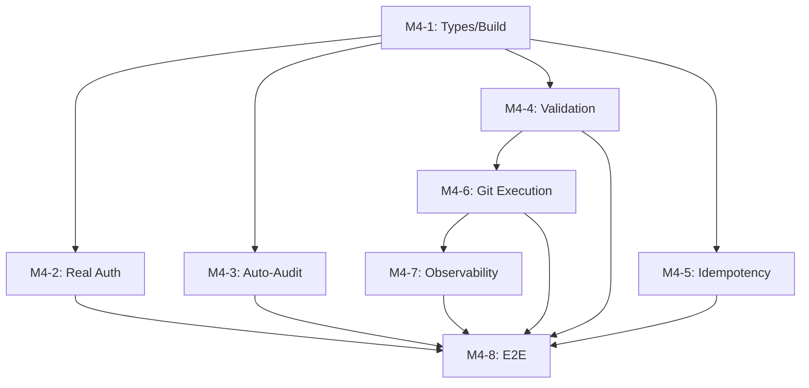

# Milestone 4 Plan: Production Readiness & Real Execution

## Goal
Complete M3 security/auditing gaps AND unlock the core value proposition: **Workflow-JK actually builds software**, not just plans it.

---

## 1. Workstreams & Tasks

### M4-1: Fix Type Errors & Build Integrity
*Unblocks everything. No dependencies.*

- [ ] Resolve 5 branded ID conflicts in `routes.ts` (TaskId vs ProjectId brand mismatch, missing UserId brand)
- [ ] Fix missing `computeAuditHash` export
- [ ] Fix signal type mismatch on workflow resume
- [ ] Fix 2 failing orchestration cancellation tests (activity dependency setup)
- [ ] **Acceptance**: `bun run build` succeeds with zero type errors; all 341+ tests pass

### M4-2: Real Authentication
*Depends on: M4-1*

- [ ] Wire `SessionRepository.validateToken()` into auth middleware (replace TODO at `auth-middleware.ts:59`)
- [ ] Add `authMiddleware` to all routes currently missing it (projects list, artifacts, audit, workflows)
- [ ] CSRF protection via `SameSite` cookies + `csrfToken` double-submit
- [ ] Server-side role enforcement: validate `X-Role` header against `OrganizationMember.role` in DB instead of trusting client headers
- [ ] Remove `AUTH_ENABLED=false` bypass (or gate it behind `NODE_ENV=development` only)
- [ ] **Acceptance**: Unauthenticated requests to protected routes return 401; wrong roles return 403; token expiry returns 401; CSRF tokens validated

### M4-3: Auto-Audit & Compliance
*Parallel with M4-4, M4-5. Depends on: M4-1*

- [ ] Auto-audit-log events: approval decisions, workflow state transitions, artifact creation, agent invocations, config changes
- [ ] Append-only enforcement: `UPDATE`/`DELETE` disabled on `audit_logs` table at DB role level
- [ ] Audit API: `GET /api/audit` with filtering (dateRange, action, actor, resourceType), pagination (cursor-based), org-scoping
- [ ] `read_only_auditor` role: can only access `GET /api/audit` and `GET /api/projects/:id/audit`
- [ ] **Acceptance**: Every mutation writes exactly one audit log entry; tamper chain is verifiable; no audit log can be updated or deleted

### M4-4: Input Validation & Security Hardening
*Parallel with M4-3, M4-5. Depends on: M4-1*

- [ ] Fastify JSON schema validation on all 21 endpoints (not just POST /projects)
- [ ] UUID validation on all path parameters (already started — finish the job)
- [ ] String input sanitization: HTML stripping, SQL injection prevention, length limits
- [ ] Content-Type validation on request bodies
- [ ] **Acceptance**: Invalid inputs return 400 with descriptive errors; no unvalidated input reaches business logic

### M4-5: Idempotency Store Implementation
*Parallel with M4-3, M4-4. Depends on: M4-1*

- [ ] Implement `IdempotencyStore` interface (Postgres implementation already has a file stub at `postgres-idempotency-store.ts` — verify and complete)
- [ ] Wire to all mutation routes: POST /projects, POST approval, POST clarification-answers, POST tasks
- [ ] Prevent double-approve (same org + workflow + artifact type = dedup)
- [ ] Workflow `resume()` idempotency: same signal processed only once
- [ ] TTL cleanup for expired keys
- [ ] **Acceptance**: Retried requests with same `X-Idempotency-Key` return original response; double-approve prevented

### M4-6: Git-Based Real Execution
*The value unlock. Depends on: M4-1, M4-4 (path validation).*

- [ ] **GitRepoProvider implementation**:
    - Add `simple-git` + `isomorphic-git` as direct dependencies to `@workflow-jk/adapters`
    - Constructor takes: `repoUrl`, `localBasePath`, `branch` (defaults to `feat/workflow-{projectId}`)
    - `clone()` → `git clone` into temp directory (`/tmp/workflow-jk/{projectId}/{runId}`)
    - `createBranch(name)` → `git checkout -b {name}`
    - `getFile(path)` → `fs.readFile` with path validation
    - `createFile/updateFile/deleteFile` → `fs.writeFile/rm` + `git add`
    - `createCommit(message, files)` → `git commit`
    - `listFiles(prefix?)` → `git ls-tree -r --name-only HEAD`
    - New method: `applyDiff(path, diff)` → apply unified diff via `git apply --check` then `git apply`
    - New method: `pushBranch()` → `git push origin {branch}`
    - New method: `cleanup()` → `rm -rf` temp directory
    - Path traversal protection: all paths validated against `ExecutionPolicy.deniedFilePathPatterns` + no `..` + no absolute paths
- [ ] **Diff-to-Repo Bridge**:
    - After DevAgent produces `changes[]`, loop through each change and apply via RepoProvider
    - Validate each path with `isFilePathAllowed(policy, path)`
    - Validate diff size with `isDiffSizeAllowed(policy, diffSizeBytes)`
    - Dry-run mode support
    - Commit after each task's changes
    - Push after all tasks complete in a workflow run
- [ ] **Workflow Integration**:
    - Wire `GitRepoProvider` into `AppContainer`
    - In `InlineWorkflowEngine.runDevAndQAStages()`: after DevAgent produces dev result, call DiffBridge to apply changes to repo
    - After QA passes: push branch; store branch name + repo URL on `WorkflowRun.metadata`
    - After rework: continue on same branch (additional commits)
- [ ] **ExecutionPolicy Enforcement**:
    - Call `isDiffSizeAllowed()` before applying each diff
    - Enforce `maxConcurrentWorkflows` in the workflow engine
    - Enforce `agentTimeoutMs` on DevAgent calls
- [ ] **TestRunner Port**:
    - Implement a basic `TestRunner` that runs `bun test` or `npm test` in the cloned repo directory
    - Wire to QaAgent's `testResults` validation: confirm test results match actual test output
    - Timeout enforcement via `ExecutionPolicy.agentTimeoutMs`
- [ ] **Acceptance**: End-to-end test: create project → workflow runs → DevAgent writes real files to git repo → QA validates → branch pushed

### M4-7: Observability Wiring
*Depends on: M4-1, M4-6*

- [ ] `workflowDuration` histogram: record in `InlineWorkflowEngine` at workflow completion
- [ ] `agentInvocationsTotal` counter: increment in `createAgent()` wrapper
- [ ] `approvalDecisionsTotal` counter: increment in approval routes
- [ ] `activeWorkflowsGauge`: track in workflow start/complete
- [ ] Call all instruments with best-effort wrapping (never throw)
- [ ] **Acceptance**: `GET /api/metrics` returns actual Prometheus-formatted metrics with non-zero values after a workflow run

### M4-8: E2E Integration Test Suite
*Depends on: all above.*

- [ ] Test: full workflow lifecycle (create → intake → clarify → approve reqs → architecture → approve arch → dev → QA → release)
- [ ] Test: rework loop (QA fails → rework → QA passes)
- [ ] Test: auth-protected routes reject unauthenticated/invalid-role requests
- [ ] Test: idempotency (duplicate request returns same response)
- [ ] Test: audit trail completeness (every mutation has audit log, chain is intact)
- [ ] Test: git execution (files written, branch pushed, path validation works)
- [ ] Test: concurrent workflow limits
- [ ] **Acceptance**: All E2E tests pass; zero type errors; full build succeeds

---

## 2. Dependency Graph

---

## 3. Risks & Mitigations

| Risk | Likelihood | Mitigation |
|------|-----------|------------|
| DevAgent LLM output not valid unified diff | High | Add `git apply --check` validation before applying; fall back to full-file `createFile` for `create` changeType |
| Git auth for push (SSH keys, tokens) | Medium | Support `REPO_AUTH_TOKEN` env var; document SSH key setup; support public repos for initial dev |
| Large repos slow clone times | Medium | Shallow clone (`--depth 1`); cache clones per org; configurable via `AppConfig` |
| Path traversal bypass | Low | Double-validation: RepoProvider validates + ExecutionPolicy validates |
| Type system complexity from branded IDs | Low | M4-1 resolves this upfront; add type helpers for brand conversion |
